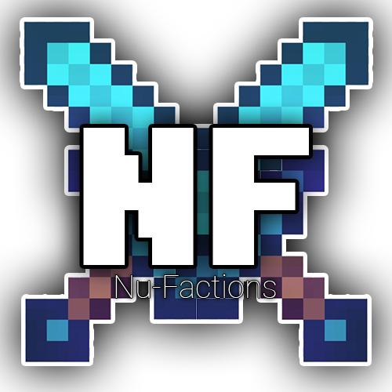

# Nu-Factions

Nu-Factions is a factions plugin for Spigot/Paper Minecraft servers.

Supported Version: >1.19
Plugin Version: v0.1.0

## Features

- Multiple Region Claims: Factions can claim multiple areas with different names and borders
- Name Tags: Display a player's faction in chat and above their head
- Leaderboard: See which clans have the most land and power
- Power System: Factions can gain power through doing tasks such as PvP, Grinding, and more
